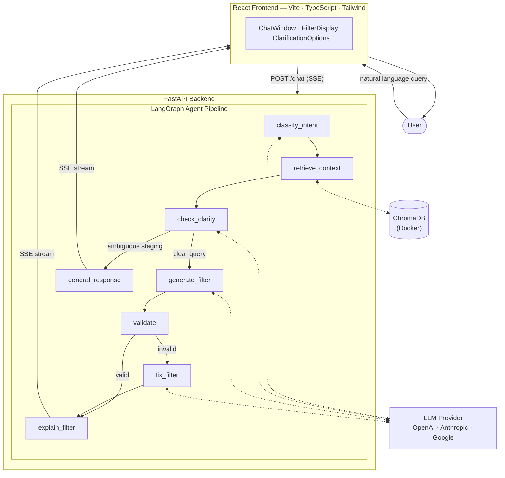

<div align="center">
  

  <h1>PCDC Cohort Discovery Chatbot</h1>

  <p><strong>Natural language → Guppy-compatible GraphQL filter JSON, instantly.</strong></p>
  <p>Describe a patient cohort in plain English — get a validated, schema-correct filter back in seconds.</p>

  <p>
    
    
    
    
    
    
    
  </p>
</div>

---

## Screenshots

<table>
  <tr>
    <td align="center" width="50%">
      
      <br/><sub><b>Landing — clean, focused entry point</b></sub>
    </td>
    <td align="center" width="50%">
      
      <br/><sub><b>Filter generation with syntax-highlighted JSON</b></sub>
    </td>
  </tr>
  <tr>
    <td align="center" width="50%">
      
      <br/><sub><b>Smart clarification — one-click staging disambiguation</b></sub>
    </td>
    <td align="center" width="50%">
      
      <br/><sub><b>Self-healing validator auto-corrects field name errors</b></sub>
    </td>
  </tr>
  <tr>
    <td align="center" width="50%">
      
      <br/><sub><b>Multi-turn context — refine filters in follow-up messages</b></sub>
    </td>
    <td align="center" width="50%">
      
      <br/><sub><b>General Q&A about the PCDC data model</b></sub>
    </td>
  </tr>
</table>

---

## How it works

The chatbot converts a free-text cohort description into a [Guppy](https://github.com/uc-cdis/guppy)-compatible GraphQL filter through a 7-step agentic pipeline:

| Step | Node | Description |
|------|------|-------------|
| 1 | `classify_intent` | Decides: filter request or general question? |
| 2 | `retrieve_context` | Fetches relevant schema fields + similar example filters from ChromaDB |
| 3 | `check_clarity` | Asks a targeted follow-up if staging is ambiguous across diseases |
| 4 | `generate_filter` | Produces Guppy filter JSON using an 11-rule prompt system |
| 5 | `validate` | Checks field existence, enum values, nested paths, and numeric types |
| 6 | `fix_filter` | Self-heals validation errors with a targeted LLM correction pass |
| 7 | `explain_filter` | Streams a plain-English explanation back to the user via SSE |

---

## Architecture



---

## Evaluation

Evaluated on a **held-out test split of 270 labelled filter examples**, stratified 80/20 by consortium with zero ChromaDB contamination:

| Metric | Score |
|--------|-------|
| Field Precision | **0.986** |
| Field Recall | **0.985** |
| **Field F1** | **0.985** |
| Value Accuracy | **1.000** |
| Validator 1st-pass rate | **100%** (79 / 79 filters) |
| Self-healing retries needed | **0** |

> Results are from a 100-example sample of the held-out split (reduced to save API cost). 94.9% of generated filters achieved a perfect F1 = 1.0.

---

## Quick Start

### Prerequisites

| Tool | Version |
|------|---------|
| Python | ≥ 3.11 |
| Node.js | ≥ 18 |
| Docker | any recent |
| LLM API key | OpenAI / Anthropic / Google |

### 1 — Environment

```bash
cd chatbot
cp .env.example .env
# Edit .env and set your API key, e.g.:  OPENAI_API_KEY=sk-...
```

### 2 — ChromaDB (vector store)

```bash
docker compose up -d
# Verify: curl http://localhost:8100/api/v1/heartbeat
```

### 3 — Backend

```bash
cd backend
python -m venv venv && source venv/bin/activate
pip install -r requirements.txt

# One-time: ingest schema + 1,078 example filters into ChromaDB
python -m retrieval.ingest

# Start the API server
uvicorn main:app --reload --port 8000
```

### 4 — Frontend

```bash
cd frontend
npm install
npm run dev     # → http://localhost:5173
```

---

## Configuration

All settings are environment variables in `chatbot/.env`:

| Variable | Default | Description |
|----------|---------|-------------|
| `LLM_PROVIDER` | `openai` | `openai` · `anthropic` · `google` |
| `LLM_MODEL` | `gpt-4o` | Model name for the chosen provider |
| `OPENAI_API_KEY` | — | Required when provider is `openai` |
| `ANTHROPIC_API_KEY` | — | Required when provider is `anthropic` |
| `GOOGLE_API_KEY` | — | Required when provider is `google` |
| `EMBEDDING_MODEL` | `text-embedding-3-small` | OpenAI embedding model used by ChromaDB |
| `CHROMA_HOST` | `localhost` | ChromaDB host |
| `CHROMA_PORT` | `8100` | ChromaDB port |
| `PROCESSED_GITOPS_JSON` | `../data/processed_gitops.json` | Field → nested-path schema |
| `PROCESSED_SCHEMA_JSON` | `../data/processed_pcdc_schema_prod.json` | Enum → fields schema |
| `ANNOTATED_FILTERS_CSV` | `../data/annotated_amanuensis_search_dump-06-18-2025.csv` | Training examples |

### Switching LLM providers

```bash
# Anthropic
LLM_PROVIDER=anthropic
LLM_MODEL=claude-sonnet-4-20250514

# Google
LLM_PROVIDER=google
LLM_MODEL=gemini-2.0-flash

# OpenAI (default)
LLM_PROVIDER=openai
LLM_MODEL=gpt-4o
```

---

## Project Structure

```
chatbot/
├── .env.example
├── docker-compose.yml
├── assets/
│   ├── logo/                      # D4CG logo
│   └── screenshots/               # UI screenshots
├── backend/
│   ├── main.py                    # FastAPI app + SSE endpoints
│   ├── config.py                  # Pydantic settings
│   ├── models.py                  # Request / response models
│   ├── requirements.txt
│   ├── agent/
│   │   ├── state.py               # LangGraph TypedDict state
│   │   ├── nodes.py               # All 8 agent node functions
│   │   ├── graph.py               # Pipeline assembly + routing
│   │   └── llm.py                 # Multi-provider LLM factory
│   ├── retrieval/
│   │   ├── ingest.py              # ChromaDB ingestion (run once)
│   │   ├── client.py              # ChromaDB client + embeddings
│   │   ├── schema_retriever.py    # Schema field retrieval
│   │   └── example_retriever.py   # Few-shot example retrieval
│   ├── validation/
│   │   └── validator.py           # Schema validator + field suggestions
│   ├── prompts/
│   │   └── templates.py           # All LLM prompt templates
│   ├── data/
│   │   ├── train.csv              # 1,078 training examples
│   │   └── test.csv               # 270 held-out test examples
│   └── scripts/
│       ├── evaluate.py            # Evaluation harness (F1 / precision / recall)
│       ├── analyse_results.py     # Deep-dive analysis of a results JSON
│       ├── preflight.py           # Dry-run environment sanity check
│       └── create_split.py        # Stratified train / test split
└── frontend/
    ├── package.json
    ├── vite.config.ts
    ├── tailwind.config.js
    └── src/
        ├── App.tsx
        ├── main.tsx
        ├── api.ts                 # SSE client
        ├── types.ts
        ├── hooks/
        │   └── useChat.ts         # Chat state + SSE management
        └── components/
            ├── Header.tsx
            ├── ChatWindow.tsx
            ├── MessageBubble.tsx
            ├── FilterDisplay.tsx
            ├── ClarificationOptions.tsx
            └── InputBar.tsx
```

---

## API Reference

### `POST /chat`

Send a message; returns a **Server-Sent Events stream**.

```json
{
  "message": "Show me all AML patients under 5",
  "conversation_id": "optional-uuid",
  "history": []
}
```

| SSE Event | Payload | Description |
|-----------|---------|-------------|
| `status` | `{"text": "Retrieving context…"}` | Live progress updates |
| `token` | `{"text": "Here is the filter…"}` | Streamed explanation text |
| `filter_json` | `{"filter": {…}, "is_valid": true, "explanation": "…"}` | Final validated filter |
| `clarification` | `{"question": "…", "options": ["…"]}` | Disambiguation required |
| `error` | `{"text": "…"}` | Unexpected error |
| `done` | `{"conversation_id": "…"}` | Stream complete |

### `GET /health`

Returns `{"status": "ok"}`.

### `GET /conversations/{id}`

Retrieve the full message history for a conversation.

### `DELETE /conversations/{id}`

Delete a conversation from the session store.

---

## Evaluation Harness

```bash
cd backend

# Sanity check — no LLM or ChromaDB calls
python -m scripts.preflight

# Run on 100 random held-out examples
python -m scripts.evaluate -n 100 --output results.json

# Run on the full 270 held-out examples
python -m scripts.evaluate --all --output results_full.json

# Deep-dive breakdown of a results file
python -m scripts.analyse_results
```

---

## Documentation

See **[TECHNICAL_DEEP_DIVE.md](TECHNICAL_DEEP_DIVE.md)** for a full walkthrough of every system layer — SSE streaming, LangGraph routing, ChromaDB dual retrieval, validator logic, the prompt rule system, LLM abstraction, and multi-turn context management.

---

## Acknowledgements

Built for the [Pediatric Cancer Data Commons](https://commons.cri.uchicago.edu/pcdc/) as part of a [Google Summer of Code](https://summerofcode.withgoogle.com/) proposal with the [Data for the Common Good (D4CG)](https://d4cg.org/) organisation.
